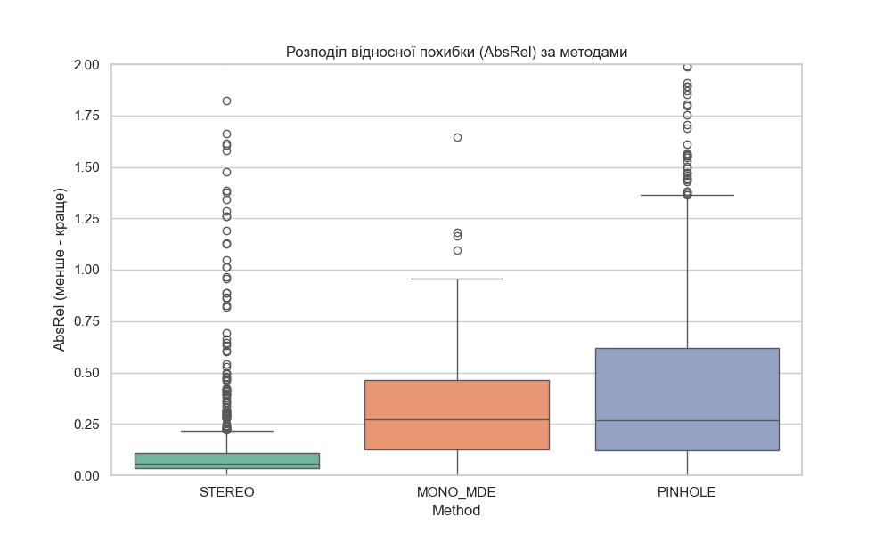
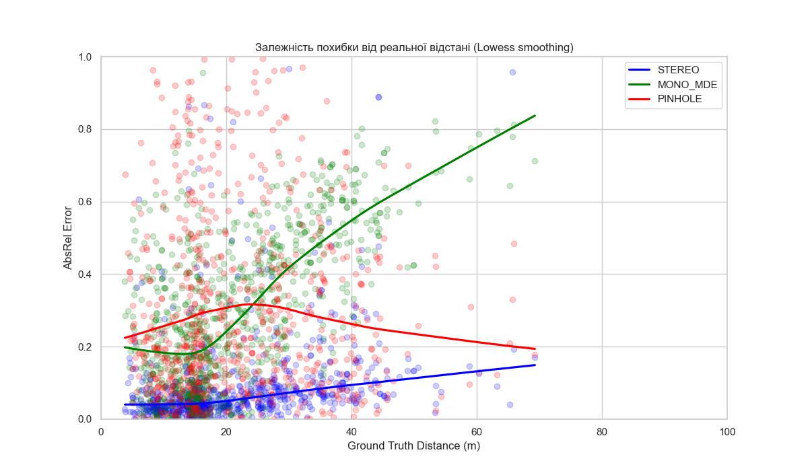
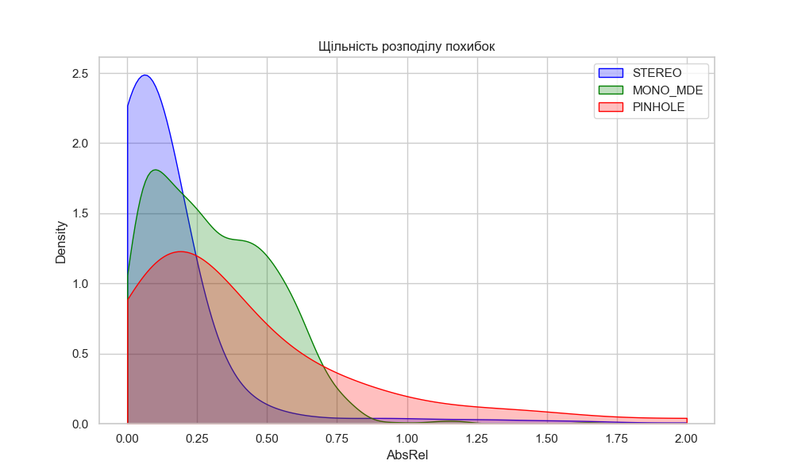
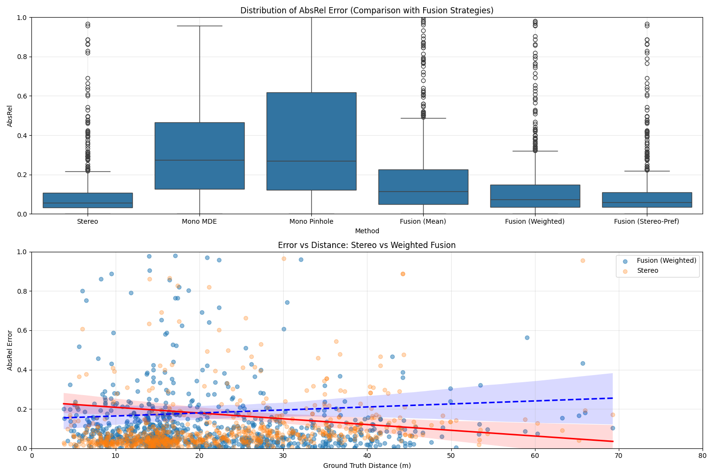

# Multi-Method Depth Estimation and Fusion

This repository contains a research project focused on monocular and stereo depth estimation, object detection, and sensor fusion for distance measurement. The project evaluates multiple approaches using the KITTI dataset and provides tools for analysis and visualization of the results.

### Key Features

*   **Stereo Depth Estimation:** Implementation of stereo-based distance measurement using KITTI stereo pairs.
*   **Monocular Depth Estimation (MDE):** Integration of MiDaS for absolute depth estimation from a single image, including scale alignment techniques.
*   **Monocular Pinhole Model:** Geometry-based distance estimation using object detection bounding boxes and known object heights.
*   **Sensor Fusion:** Implementation of various fusion strategies (Weighted Fusion, Stereo-Preference, etc.) to combine multiple depth sources for improved accuracy and robustness.
*   **Evaluation Metrics:** Comprehensive evaluation using metrics such as AbsRel (Absolute Relative Error), RMSE, $\delta_1$, and SILog.
*   **ArUco Support:** Tools for depth calibration and validation using ArUco markers.

### Project Structure

*   `main_stereo.py`: Core script for stereo-based detection and depth estimation.
*   `main_mono_mde.py`: Evaluation of Monocular Depth Estimation (MiDaS) with scale alignment.
*   `main_mono_pinhole_kitti.py`: Distance estimation using the pinhole camera model on KITTI.
*   `fusion_analysis.py`: Script for analyzing and merging results from different methods using fusion strategies.
*   `mian_mono_aruco.py`: Monocular depth estimation using ArUco markers for scale.
*   `models/`: Contains wrappers for object detectors and depth estimators.
*   `vision/`: Core vision utilities for camera modeling and preprocessing.

### Usage

1.  **Stereo Evaluation:**
    ```bash
    python main_stereo.py
    ```
2.  **Mono MDE Evaluation:**
    ```bash
    python main_mono_mde.py
    ```
3.  **Fusion Analysis:**
    ```bash
    python fusion_analysis.py
    ```

### Results

The project evaluates depth estimation accuracy across different distances. Below are the key visualizations of the error distributions and fusion performance.

#### Error Analysis

*Distribution of depth estimation errors across different methods.*


*Analysis of how estimation error increases with distance from the camera.*


*Density plot showing the concentration of estimation errors.*

#### Fusion Comparison

*Comparison of individual methods versus various fusion strategies (Mean, Weighted, Stereo-Preferred).*

#### Performance Summary
Based on the `session_report.txt`, the system achieves the following typical performance on the KITTI dataset:
*   **Stereo Processing Time:** ~12ms
*   **Object Detection Time:** ~14ms (SSD MobileNet v2)
*   **Average AbsRel:** Varies by method, with Fusion strategies showing improved stability over pure monocular approaches.
